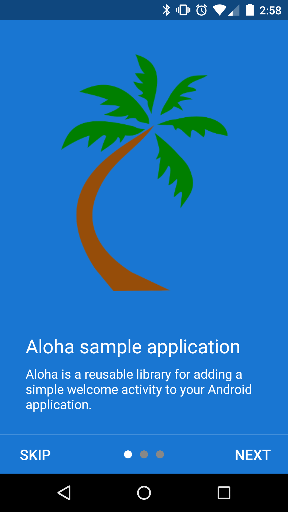
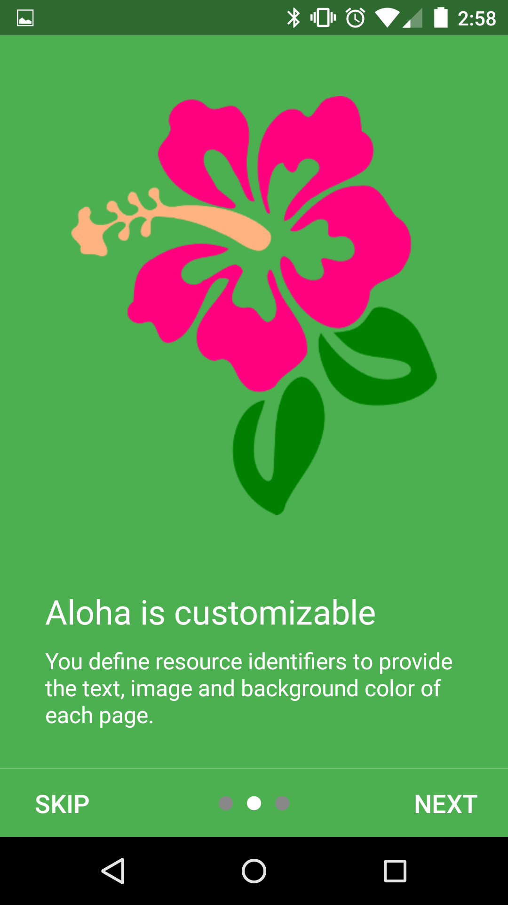
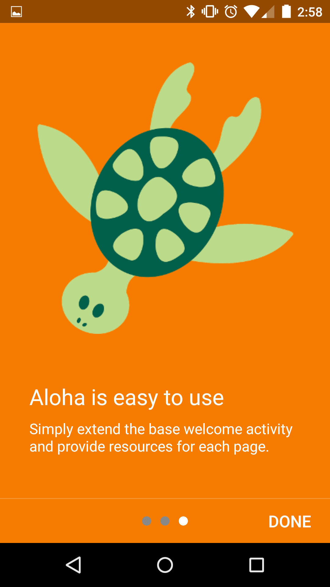
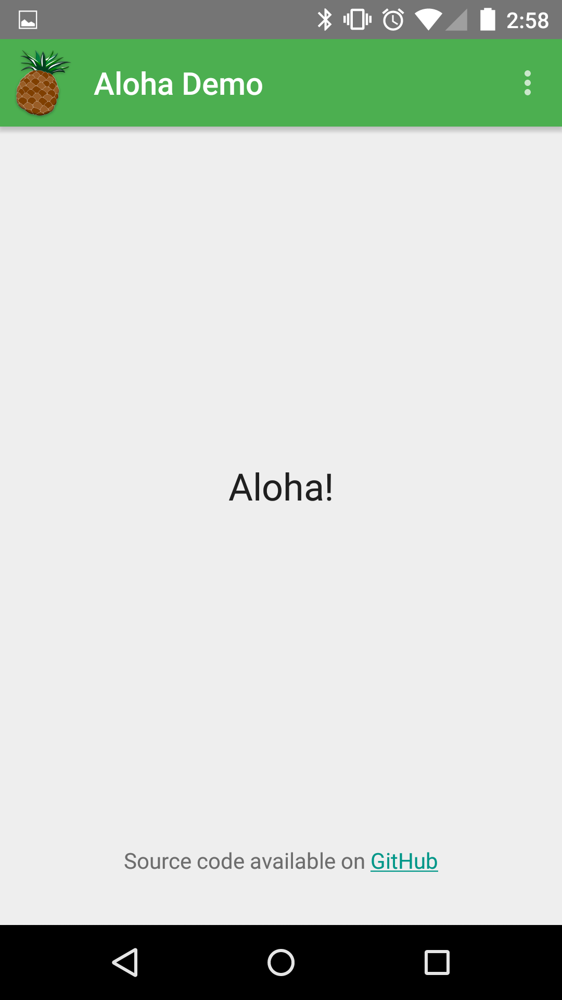

Aloha Sample
============
Aloha is a library for adding a simple welcome activity to your Android app. This is a demo application for
the Aloha library.

Documentation
-------------
See the [Aloha](http://bdiegel.github.io/android-aloha) project page for more details.

Sample application
------------------
The sample application can also be installed from the Play Store.

  

Library
-------
See the [android-aloha](https://github.com/bdiegel/android-aloha) project for the source code.

Library Usage
-------------
The library is available on JCenter. Add the dependency to your build.gradle file:

    dependencies {
        compile 'honuapps:aloha:0.9.0'
    }

Acknowledgments
---------------
The sample application uses images under CC0 license.

License
-------
ISC license information [LICENSE](LICENSE.txt)

